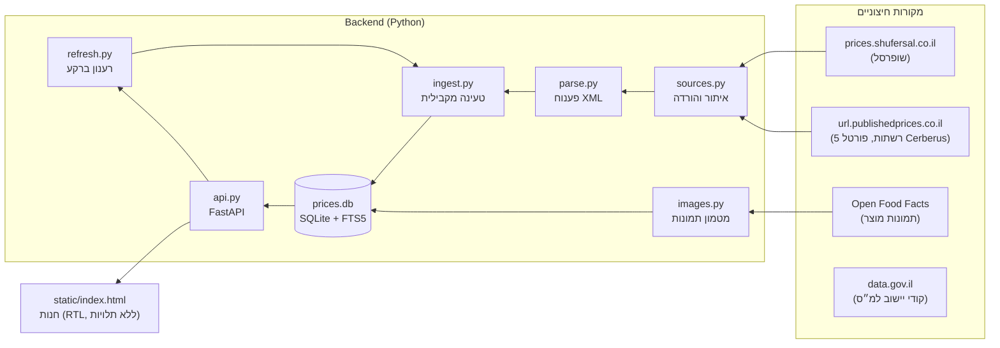

# FinitiOnline — אפיון טכני

> גרסה 1.0 · אוגוסט 2026 · מסמך חי — לעדכן עם כל שינוי ארכיטקטוני

## 1. תקציר

מערכת השוואת מחירי סופרמרקטים מעל **קבצי שקיפות המחירים הרשמיים** שהרשתות מחויבות
לפרסם לפי חוק המזון (2014). המערכת מורידה את הקבצים ישירות מהמקורות הרשמיים,
מפענחת ומאחדת אותם למסד SQLite מקומי, ומגישה חנות-השוואה בדפדפן מעל FastAPI.

אין גירוד (scraping) של אתרי מסחר ואין תלות ב-API פנימי של אף רשת — רק הקבצים
שהרשתות מפרסמות בחוק.

## 2. ארכיטקטורה



## 3. מקורות נתונים

| מקור | רשתות | פרוטוקול | הערות |
|---|---|---|---|
| `prices.shufersal.co.il` | שופרסל | HTTP פתוח | ה-endpoint האמיתי הוא `/FileObject/UpdateCategory?catID=N&page=M`; הפרמטר בדף הראשי לא מסנן |
| `url.publishedprices.co.il` | רמי לוי, יוחננוף, אושר עד, טיב טעם, קשת טעמים | התחברות עם שם משתמש (סיסמה בד"כ ריקה) | ה-CSRF token מדף הכניסה **אינו** תקף ל-API; חובה לקחת את זה שמופיע ב-`/file` אחרי ההתחברות |
| Open Food Facts | תמונות לפי ברקוד | REST | ~60% כיסוי לברקודים ישראליים. Rate limit אגרסיבי — ראו §8 |
| data.gov.il | מילון קודי יישוב למ״ס → שם | CKAN datastore | הורד חד-פעמית ל-`pricelist/city_codes.json` (1,310 יישובים) |

### פורמט שמות הקבצים

`PriceFull<chain13>-<subchain>-<store>-<YYYYMMDD>-<HHMMSS>.gz`
הסוגים: `Price` (עדכון חלקי, מתפרסם כל שעה~), `PriceFull` (תמונה מלאה פר סניף, ~יומי),
`Promo`/`PromoFull` (מבצעים), `Stores`/`StoresFull` (קובץ סניפים).
המערכת טוענת כברירת מחדל `PriceFull` בלבד — קובץ אחד עדכני לכל סניף.

## 4. מבנה הקוד

```
shopinglist.py          CLI: chains / fetch / search / product / basket / stats /
                             categorize / images / serve
pricelist/
  sources.py            ChainSpec + שני מימושי Source (שופרסל, Cerberus)
  parse.py              פענוח XML סלחני (קידודים, שמות שדות ושגיאות כתיב בין רשתות)
  ingest.py             הורדה מקבילית (ThreadPool) → כתיבה ל-SQLite בתהליכון הראשי
  db.py                 סכימה, אינדקס FTS5, אגרגטים, סיווג מחלקות
  query.py              שאילתות: חיפוש, עיון, מוצר, סל, סניפים
  categories.py         סיווג מוצרים למחלקות לפי מילות מפתח (אין קטגוריות בקבצים!)
  images.py             שליפת תמונות מ-OFF + מטמון + תחליף SVG לפי מחלקה
  refresh.py            רענון ברקע מתוך השרת, עם לוג התקדמות וסטטוס
  api.py                FastAPI — כל ה-endpoints + הגשת הסטטיק
  city_codes.json       מילון קודי יישוב למ״ס (1,310 יישובים)
static/index.html       החנות — קובץ יחיד, RTL, ללא ספריות חיצוניות
static/how.html         עמוד "איך זה עובד" עם דיאגרמות
```

## 5. סכימת המסד (SQLite, WAL)

| טבלה | מפתח | תפקיד |
|---|---|---|
| `chains` | `chain_id` | הרשתות (slug, שם) |
| `stores` | `(chain_id, store_id)` | סניפים: שם, כתובת, קוד עיר למ״ס |
| `products` | `item_code` (ברקוד) | שורה אחת למוצר + אגרגטים: `store_count`, `min/max/avg_price`, `category` |
| `prices` | `(chain_id, store_id, item_code)` | מחיר עדכני לכל צירוף. **WITHOUT ROWID** |
| `ingest_log` | `filename` | כל קובץ שנטען — הבסיס לאינקרמנטליות |
| `product_images` | `item_code` | מטמון OFF: url + status (`ok/none/error`) |
| `orders` | `id` | עגלות שנסגרו: תאריך, סה"כ, פריטים כ-JSON |
| `products_fts` | FTS5 | אינדקס חיפוש: `unicode61`, `prefix='2 3 4'`, תוכן מ-products |

**החלטות מפתח:**
- מוצר ומחיר הופרדו: `PriceFull` הוא פר-סניף ולכן אותו ברקוד חוזר מאות פעמים.
  החיפוש רץ על `products`; ההשוואה על `prices`.
- מחיר חדש **דורס** ישן (`ON CONFLICT ... UPDATE`) — אין היסטוריה (מועמד לשדרוג).
- `manufacturer` לא נדרס ע"י ערך "לא ידוע" מרשת אחרת (COALESCE+NULLIF).
- אגרגטים (`min_price` וכו') מחושבים מחדש בסוף כל טעינה ב-`refresh_aggregates`,
  יחד עם rebuild מלא של ה-FTS.
- PRAGMA: `journal_mode=WAL`, `synchronous=NORMAL`, `cache_size=-64000`.

## 6. זרימת טעינה (fetch / רענון)

1. `latest_per_store(kind)` — הקובץ העדכני ביותר לכל סניף.
2. סינון מול `ingest_log` — קובץ שנטען פעם לא יורד שוב (אלא ב-`--force`).
3. הורדה + פענוח בעד 6 תהליכונים במקביל; **כתיבה ל-SQLite רק בתהליכון הראשי**.
4. commit אחרי כל קובץ + רישום ב-`ingest_log` (עמידות להפסקה באמצע).
5. בסוף: `refresh_aggregates` + `assign_categories` למוצרים חדשים.

### רענון מתוך השרת (`refresh.py`)

- `POST /api/refresh` פותח תהליכון רקע עם **חיבור SQLite נפרד** (WAL מאפשר לקריאות
  ה-API להמשיך במקביל).
- תוכנית הרענון נגזרת מהמסד: הרשתות שכבר טעונות, כל אחת עם מספר הסניפים הנוכחי שלה.
- `GET /api/refresh` מחזיר סטטוס חי: `running`, לוג (200 שורות אחרונות), תוצאות, שגיאה.
- מנעול מונע שני רענונים במקביל. ה-UI פולל כל 2 שניות ומצייר מחדש בסיום.

### מודל "טעינה לפי עיר" (city-first)

ברירת המחדל: מסד **בלי מחירים בכלל**. המשתמש בוחר בממשק ערים (מולטי-סלקט) ולוחץ
"טען נתונים" → `POST /api/load_city {"cities": ["8600", ...]}` (קודי למ"ס):

1. `_city_plan` שולף מ-`stores` את כל הסניפים הידועים בערים האלה, לפי רשת.
2. `ingest_chain(store_ids=...)` מסנן את רשימת הקבצים של כל רשת רק לסניפים האלה.
3. אותו מנגנון סטטוס/לוג של הרענון; משתמש חדש עם מסד ריק מקבל את בוחר הערים
   אוטומטית בכניסה.

היתרון: דיסק ותעבורה פרופורציונליים למה שהמשתמש באמת צריך (עיר ≈ 5–50MB במקום
GB), והשוואת המחירים מוגבלת ממילא לסניפים שרלוונטיים לו. קובץ הסניפים המלא של כל
רשת נטען בכל מקרה (זול), ולכן רשימת הערים הזמינות לטעינה מלאה תמיד.

## 7. API (FastAPI)

| Method | Endpoint | תפקיד |
|---|---|---|
| GET | `/api/browse` | קטלוג לפי מחלקה; מיון, עימוד, `chain`/`store` (בחירה מרובה בפסיקים) |
| GET | `/api/search` | חיפוש FTS + הקלה הדרגתית; מחזיר דגל `relaxed` |
| GET | `/api/suggest` | השלמה אוטומטית קלה |
| GET | `/api/product/{code}` | מוצר + מחיר בכל סניף |
| POST | `/api/basket` | דירוג סניפים לסל שלם (עם כמויות וחוסרים) |
| GET | `/api/categories` | מחלקות + ספירה |
| GET | `/api/chains`, `/api/stores` | רשתות וסניפים (`city`, `with_prices`) |
| GET | `/api/cities` | מילון קודי למ״ס → שם עברי |
| GET | `/api/image/{code}`, `/api/images` | תמונה (redirect / SVG תחליפי) ובדיקה מרוכזת |
| POST/GET | `/api/refresh` | הפעלת רענון ברקע / סטטוס חי |
| POST | `/api/load_city` | טעינת כל סניפי הערים שנבחרו (קודי למ"ס, ברקע) |
| POST/GET/DELETE | `/api/orders[...]` | סגירת רשימה, היסטוריה, פרטים, מחיקה |
| GET | `/api/stats` | מצב המסד |
| GET | `/docs` | תיעוד OpenAPI אינטראקטיבי |

### בחירה מרובה בסינון

`chain` ו-`store` מקבלים רשימות מופרדות בפסיקים, כולל ערבוב של רשתות שלמות
וסניפים בודדים. `parse_selection` הופך את זה ל-`[(chain_id, store_id|None), ...]`,
ו-`_sel_pred` בונה תנאי OR אחד על טבלת `prices` שמשרת את החיפוש, הקטלוג, ספירת
המחלקות והאגרגטים (`_sel_stats`).

### חיפוש סלחני (הקלה הדרגתית)

כשהחיפוש המדויק (כל מילה כתחילית, AND) מחזיר 0 תוצאות:

1. **צורת בסיס לכל מילה** (`_best_prefix`): הסרת סיומות ריבוי (ים/ות/יות) עם
   נרמול אות סופית (בטעמ→בטעם), ניסיון גם בלי אות שימוש מובילה (ובלמכשה),
   ואם צריך - קיצוץ הדרגתי עד 3 תווים. כל מועמד נבדק מול האינדקס
   (`MATCH ... LIMIT 1` - זול).
2. הרצה מחדש עם הבסיסים ב-AND: "מסטיקים בטעמים" → `מסטיק* AND בטעם*`.
3. אם עדיין ריק ויש כמה מילים - OR: מספיקה התאמה לחלק מהמילים.

התשובה מסומנת `relaxed: true` וה-UI מציג "תוצאות **דומות** עבור...". אותו מנגנון
פועל גם בהשלמה האוטומטית (`suggest`).

## 8. תמונות (Open Food Facts)

OFF מתעדים תקרה של 100 בקשות/דקה אבל בפועל חוסמים הרבה קודם. לכן:
עובד יחיד, בקשה כל ~2.5 שניות, האטה אקספוננציאלית על `429` והתאוששות הדרגתית.
כל תוצאה (כולל "לא נמצא") נשמרת ב-`product_images` לתמיד. התחליף: SVG מעוצב לפי
מחלקה עם `Cache-Control` קצר. `PRICES_NO_IMAGES=1` מכבה את המנגנון.

## 9. Frontend

קובץ יחיד (`static/index.html`), ללא ספריות. עברית RTL מלאה.
- **פלטה**: נייבי `#17418f` + תכלת `#2ea3dd` על לבן (מיתוג FinitiOnline), תמיכת dark mode
  בשלוש דרכים: `prefers-color-scheme`, `data-theme="dark"`, `data-theme="light"`.
- **עגלה**: פאנל sticky בצד שמאל בדסקטופ; מגירה במובייל (<1000px). נשמרת ב-`localStorage`.
  שים לב: `overflow-x:clip` (לא `hidden`) על ה-body — אחרת ה-sticky נשבר.
  כפתור "סגור רשימה ושמור" שומר את העגלה כהזמנה בהיסטוריה.
- **סינון**: מולטי-סלקט לערים ולרשתות/סניפים בשני המודאלים, עם לחצן "שמור בחירה"
  שמאשר (עד אז הבחירה pending). מתחת לכותרת מוצג תמיד "סינון נבחר: עיר ... · רשת ..."
  עם לחצן "נקה סינון". קודי הלמ״ס מתורגמים לשמות דרך `/api/cities`.
- **חיפוש**: מתחת לכותרת; זכוכית מגדלת מתחלפת ב-✕ אדום לניקוי כשיש טקסט;
  כפתור ↑ חזרה-למעלה מופיע אחרי גלילה.
- **תמונות**: מוצרים בלי תמונה נכנסים לתור ונבדקים שוב כל 6 שניות (עד 6 ניסיונות).

## 10. ביצועים ונפחים

במודל ה-city-first הנפח תלוי בערים שנטענו. סדרי גודל:

| מדד | ערך |
|---|---|
| רשתות נתמכות | 13 |
| סניפים ידועים (קטלוג הסניפים תמיד מלא) | ~1,160 |
| עיר בינונית (רמת גן: 20 סניפים, 6 רשתות) | ~95K מחירים, טעינה ~2–4 דק' |
| גודל מסד עם עיר אחת | ~35MB |
| טעינת סניף בודד | ~6–20K פריטים, 1–2 שניות |
| טעינה מלאה של הכל (`fetch --all --stores 0`) | מיליוני שורות, ~1GB, עשרות דקות |

רוב זמן הטעינה של עיר עם סניפי שופרסל הוא דפדוף ברשימת הקבצים שלהם
(~420 סניפים בעמודים) — מועמד למטמון.

## 11. הרצה

```powershell
python -m venv .venv
.\.venv\Scripts\pip install -r requirements.txt     # requests, fastapi, uvicorn
python shopinglist.py fetch --all --stores 10       # טעינה ראשונית
python shopinglist.py serve                          # http://127.0.0.1:8000
```

משתני סביבה: `PRICES_DB` (נתיב מסד חלופי), `PRICES_NO_IMAGES=1` (בלי OFF).

## 12. מגבלות ידועות וכיווני המשך

- **אין היסטוריית מחירים** — מחיר נדרס בעדכון. שדרוג מתבקש: טבלת `price_history`.
- **אין מבצעים** — קבצי `Promo` לא נטענים עדיין.
- **רענון ידני** — אין תזמון מובנה; כפתור באתר או cron חיצוני.
- **ללא אימות** — מיועד להרצה מקומית/רשת ביתית; אין הרשאות על `orders`.
- רשתות שטרם נתמכות: ויקטורי/מחסני השוק (matrixcatalog), קרפור, קינג סטור
  ודומיהן (binaprojects), סופר-פארם — כל אחת דורשת מימוש `Source` חדש.
